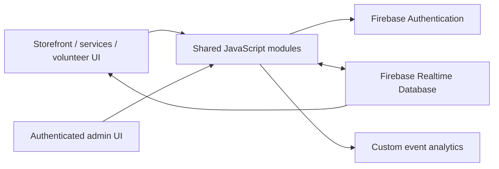

<div align="center">

<sub>Real photography by <a href="https://unsplash.com/photos/focused-student-studying-at-a-library-table-with-a-laptop-NASjMHJ9OhI">Ashutosh Gupta on Unsplash</a>.</sub>

# Prosper Eagle Shack
### A community storefront for merchandise, announcements, volunteering, and realtime administration.


[Experience](#platform-experience) · [Architecture](#architecture) · [Setup](#local-preview) · [Security](#security-model)
</div>

---

## Overview

Prosper Eagle Shack is a responsive school-store and community-engagement platform. The public experience presents merchandise, announcements, services, and volunteer opportunities; the administrative experience authenticates staff and manages realtime records. A custom client analytics layer records page views, interactions, section engagement, scroll depth, and conversion events.

## Platform experience

| Surface | Purpose |
|---|---|
| `index.html` | Main storefront and school-store experience |
| `services.html` | Store offerings and service information |
| `volunteer.html` | Community opportunity discovery and registration |
| `login.html` | Administrative sign-in |
| `admin.html` / `admindashboard.html` | Authenticated content, opportunity, and inventory operations |

## Architecture



## Notable implementation details

- Mobile navigation, scroll behavior, and back-to-top controls
- Realtime announcements and volunteer-opportunity loading
- Opportunity classification, priority, capacity, and date formatting helpers
- Anonymous browser-side user/session identifiers for analytics
- Page-view, interaction, engagement, scroll-depth, and conversion measurement
- Separate authentication and administration modules
- Large custom responsive design system in `styles.css`

## Local preview

```bash
git clone https://github.com/TanishC4444/ProsperEagleShack.git
cd ProsperEagleShack
python -m http.server 8000
```

Visit `http://localhost:8000`. Firebase-backed features require a valid project configuration and authorized origin.

## Repository map

```text
ProsperEagleShack/
├── index.html
├── services.html
├── volunteer.html
├── login.html
├── admin.html
├── admindashboard.html
├── scripts.js          public data + UX + analytics
├── auth.js             authentication
├── admin.js            administrative operations
└── styles.css          responsive visual system
```

## Security model

Firebase client configuration is not a privileged secret, but authorization must be enforced in Firebase Security Rules—not only in JavaScript or hidden pages. Administrative writes should require authenticated, authorized identities. Analytics collection should be documented with an appropriate privacy policy and avoid unnecessary personal data.

## Engineering tradeoffs

- Static hosting keeps deployment simple while Firebase supplies realtime state.
- Client-only data access creates responsive UX but makes security rules critical.
- Separate public/auth/admin modules improve responsibility boundaries.
- The repository has no build step, tests, or configuration template.
- Very large inline/site assets increase clone and page weight.

## Skills demonstrated

Responsive web design · realtime databases · authentication · admin dashboards · event analytics · community-product UX · modular JavaScript · client-side security reasoning

## Resume-ready highlight

> Developed a responsive school-commerce and volunteering platform with Firebase authentication, realtime announcements/opportunities, authenticated administration, inventory-oriented workflows, and custom engagement/conversion analytics.

## License

No open-source license file is currently included.

